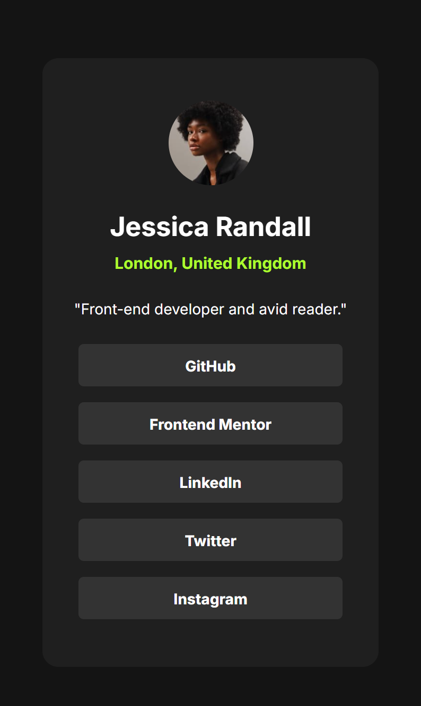

# Olá! Eu sou o Jonathan 👋

Bem-vindo ao meu GitHub! Aqui você encontrará projetos e repositórios onde exploro novas tecnologias, crio soluções e compartilho meu aprendizado.

## Sobre Mim

👨‍💻 **Desenvolvedor Front-End** em aprendizado.\
🎓 Cursando "Front-End Completo" da Danki Code e.\
🌍 Atualmente baseado em Poços de Caldas, MG.\
📚 Apaixonado por aprender e explorar novas tecnologias.

## Projetos em Destaque

#### Estou estudando e atualizando alguns projetos que fiz
Tentando colocar em prática o que estou aprendendo no momento.

### Projeto 1: [Links Sociais]
Atividade da plataforma Front-end Mentor

[Link para o projeto](https://johnslayk.github.io/social-links-profile-main/)

## Contato

Você pode me encontrar nas seguintes plataformas:
- [LinkedIn](https://www.linkedin.com/in/jonathanwslk)
- [Instagram](https://www.instagram.com/johnslayk/)
- [E-mail](mailto:jonathan.wslk@gmail.com)

Fique à vontade para explorar meus repositórios e contribuir com sugestões ou colaborações.

---

> "A melhor forma de prever o futuro é criá-lo." – Alan Kay

Obrigado pela visita!